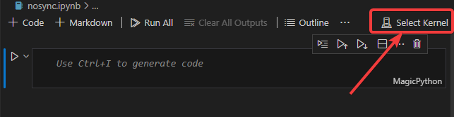
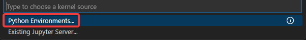
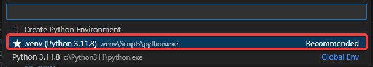

<h1> Table of Contents </h1>

- [Vitual Environment](#vitual-environment)
  - [What](#what)
  - [Why](#why)
  - [When](#when)
  - [How](#how)
    - [Python script](#python-script)
    - [Jupyter Notebook](#jupyter-notebook)

# Vitual Environment

## What

A Python virtual environment, often referred to as `venv`, is a tool that helps to keep dependencies required by different projects separate by creating isolated Python virtual environments for them. 

## Why

- Futureproofing. For ex. if you use `pandas` and the library removes or renames a function a year from now, it can break all your existing projects or scripts. By creating venv for each project, it prevents the version of libraries from being overridden.
- Disk Space. If you install all python packages directly to home directory, then over time, they will just accumulate and constantly take up more space in your hard disk. `venv` on the otherhand can easily be wiped when and as needed.
- Managing multiple projects. Say you have 2 projects (P1 and P2). P1 was written with `pandas` version `1.1.5` but P2 requires `pandas` version `2.0.1` because you want to use a new function that was added to the latest version. Normally installing one will wipe the other, but venv lets you keep and use them both.

## When

You should use virtual environment, if you are installing external package.

## How

### Python script

Create a virtual environment (This only needs to be done once in a given project)

```cmd
python -m venv .venv
```

Activate the virtual environment

```cmd
.venv\Script\activate
```

### Jupyter Notebook

Create a virtual environment (This only needs to be done once in a given project)

1. Create a virtual environment by opening terminal (`Terminal` > `New Terminal`) in VSCode
2. Run `python -m venv .venv`

Set the environment in jupyter notebook

1. Open the jupyter notebook of your choice.
2. 
3. 
4. 