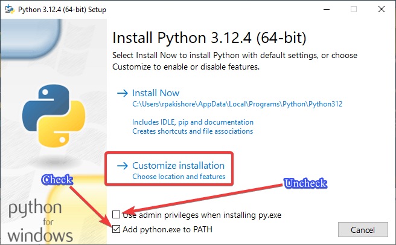
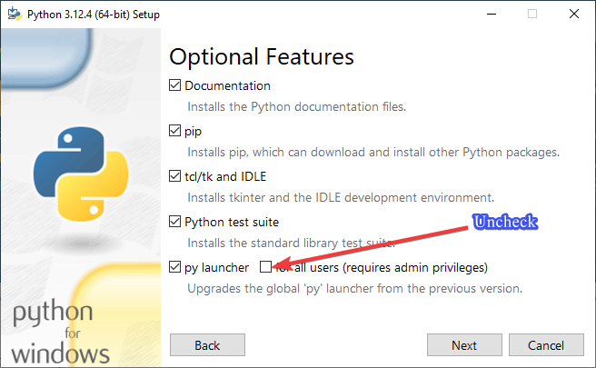
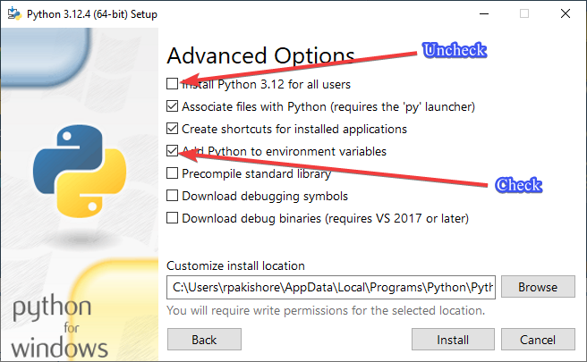

<h1> Table of Contents </h1>

- [Installing Python](#installing-python)
- [VSCode](#vscode)

# Installing Python

1. [Download the latest version of Python](https://www.python.org/downloads/) directly from python.org and run the `.exe` file.
2. 
3. 
4. 

# VSCode

1. Download VSCode from [offical source](https://code.visualstudio.com/download) and run the `.exe` file.
2. Open `VSCode` after installation and navigate to the extensions menu (`View` > `Extensions`)
3. Search and install the following extensions:
   1. ms-toolsai.jupyter
   2. magicstack.MagicPython
   3. ms-python.vscode-pylance
   4. donjayamanne.python-extension-pack
   5. yzhang.markdown-all-in-one